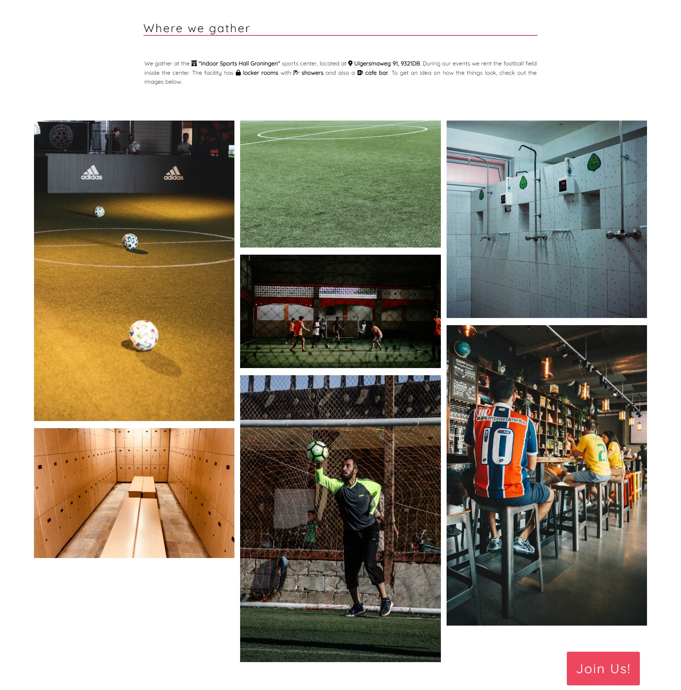

# 5v5 Football Groningen

The 5v5 Football Groningen is a website meant for the English speaking football loving residents of Groningen(NL) who want to play 5 a side football in a friendly setting.

The users of this website have access to the necessary information about the community. They are able to find out the way to join the community, the time and location of the 
5v5 Football Groningen events and the facilities the community rents. The users also have access to a sign up form. This website is targeting the expats who moved to Groningen on 
their own and don't have a big enough network of friends or acquaintances to be able to organize or participate in football events. 

## Features

- ### Navigation bar
    - The navigation bar informs the user about the name of the community: 5v5 Groninen, and makes the website pages easily accessible. 
    - Located at the top of the website pages. In the left corner is shown the community name (5v5 Football Groningen), that links to the home page.
    - The other links are in the right corner: Home, Venue, Contact; which link to every page on the website.
    - The font used in the navigation bar and on the rest of the website content is chosen to look informal and friendly with a white color chosen to contrast with the background which is blue.
    - The navigation link that links to the current page is highlighted in a bright yellow color to facilitate the user's navigation through the website. 

- ### The Hero Image
    - The Hero Image features a welcoming message written in white on a fooball-related background image.
    - A "Join Us" button is on the right side of the Hero Image, linking to the Contact page. The color of the button is red, contrasting with the background and its positioning is static in order to provide an easy way for the user to get in contact with the community.
    = The Hero Image provides the user with clear information on club members' general profile.

- ### The General Information Section
    - This section explains the user what version of football the community plays, the steps one needs to undertake to be a part of the 5v5 Football Groningen community and the contribution one is expected to bring once they become part of the community.
    - To keep the user engaged and interested in reading the General Information  section text, green icons are used to represent the steps to join the community.

- ### The Events Section
    - The Events section informs the user on the day, time and the location of the events the community organizes.
    - The event content division has a red background to make it stand out from the rest of the website content and every line of text is preceded by an icon to express in a clear way what the text means.

- ### The Website Footer
    - The Website Footer encourages the user to get in contact with teh community by containing familiar social media icons.
    - The Website Footer is important because it provides the user with other ways to contact the community than the Contact page. 
    - The blue color and the familiarity of the social media icons provide the user with a sense of security and trustworthyness.

- ### The Venue Page
    - The Venue Page is designed to provide useful information for the user about the place 5v5 Football Groningen rents during their events.
    - The description of the Venue presents information like the address and the facitlies provided at the location. The icons in the text are meant to make the text easier to read and to provide the maximum amount of information on a quick scan of the text.
    - The gallery has the purpose to give the user an idea of what the Venue and its facilities look like. 

- ### The Contact Page
    - The Contact page has a form to collect detalis from the website users willing to join the community on the right side and on the left side, some helpful tips to assist the users in their completion of the form.
    - The form collects the user's first and last names, email, phone number, what events they prefer to attend and what suggestions they have for the community.
    - The form provides value to the user by giving them the opportunity to join 5v5 Football Groningen community.  

## Testing
- I tested the website works in different browsers: Microsoft Edge, Google Chrome, Mozila Firefox, Safari, Opera.
- I confirmed this project is responsive and functions on all standard screen sizes using devtools device toolbar.
- I confirmed the website pages' content is readable and easy to understand.
- I confirmed the form works: requires entry in all the fields except for the Select element and the Suggestions box, only will accept an email address in the email input field and the submit button works.

## Bugs
- ### Solved bugs
    - The Events section was missing a header, a warning brought up when testing the code with a Validator. I solved the issue by adding the "Our events:" header to the section.
    

    - During the Validator testing, it was discovered the attribute "type" was used on the "select" element in the form. I removed the "type" attribute.
    

    - I used the following "pattern" attribute in the "tel" input:  pattern="[0-9]{3}-[0-9]{3}-[0-9]{4}". This pattern required the users to introduce the dash character while typing in the number and also a fixed number of numeric characters, when the users were more likely to go with phone numbers like these: 0684754463, 684487132, +31680004712, etc. As a solution to the problem I removed the pattern so the users can freely introduce their phone number in a format familiar to them.

## Validator Testing
- ### HTML
    - No errors were returned after testing with official W3C validator.
- ### CSS 
    - No errors were returned after testing with the official Jigsaw validator.
- ### Accessibility
    - I confirmed the fonts and colors chosen are easy to read and the webpages are accessible by running the webside through lighthouse in devtools.

    Home page  
      
    Venue page  
      
    Contact page  
      

## Unfixed Bugs

No unfixed bugs

## Deployment
- ### The website was deployed to GitHub pages. The steps to deploy are as follows
    - In the GitHub repository, navigate to the Settings tab;
    - From the source section drop-down menu, select the Master Branch;
    - Once the master branch has been selected, the page provides the link to the completed website.

The live link can be found here: XXXXXXX

## Credits

### Content
- The code for the footer social media links was taken from the Code Institute Love Running Project.

### Media
- The hero image was taken from [Pixabay](https://pixabay.com/).
- The venue page images were taken from [Pexels](https://www.pexels.com/), [Pixabay](https://pixabay.com/), [Unsplash](https://unsplash.com/).

