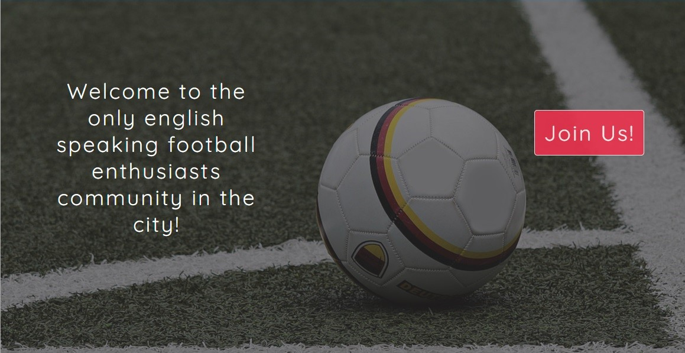

# 5v5 Football Groningen

The 5v5 Football Groningen is a website meant for the English speaking football 
loving residents of Groningen(NL) who want to play 5 a side football in a friendly 
setting.

The users of this website have access to the necessary information about the community. 
They are able to find out the way to join the community, the time and location of the 
5v5 Football Groningen events and the facilities the community rents. The users also have 
access to a sign up form. This website is targeting the expats who moved to Groningen on 
their own and don't have a big enough network of friends or acquintances to be able to 
organize or participate in football events. 

## Features

- ### Navigation bar
    - The navigation bar informs the user about the name of the community: 5v5 Groninen, and makes the website pages easily accessible. 
    - Located at the top of the website pages. In the left corner is shown the community name (5v5 Football Groningen), that links to the home page.
    - The other links are in the right corner: Home, Venue, Contact; which link to every page on the website.
    - The font used in the navigation bar and on the rest of the website content is chosen to look informal and friendly with a white color chosen to contrast with the background which is blue.
    - The navigation link that links to the current page is highlighted in a bright yellow color to facilitate the user's navigation through the website. 

- ### The Hero Image
    - The Hero Image features a welcoming message written in white on a fooball-related background image.
    - A "Join Us" button is on the right side of the Hero Image, linking to the Contact page. The color of the button is red, contrasting with the background and its positioning is static in order to provide an easy way for the user to get in contact with the community.
    = The Hero Image provides the user with clear information on club members' general profile.

- ### General Information Section
    - This section explains the user what version of football the community plays, the steps one needs to undertake to be a part of the 5v5 Football Groningen community and the contribution one is expected to bring once they become part of the community.
    - To keep the user engaged and interested in reading the General Information  section text, green icons are used to represent the steps to join the community.

